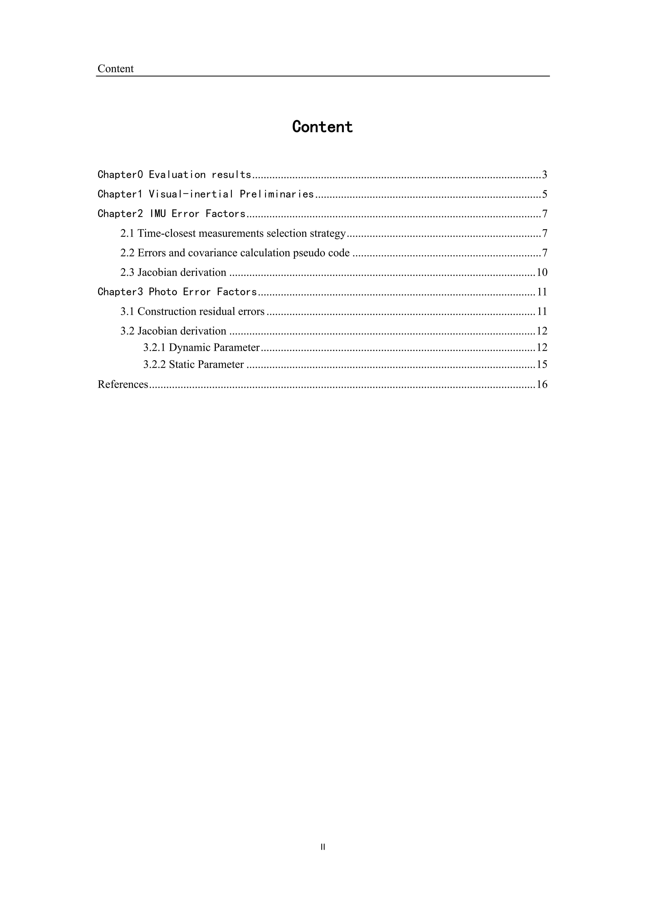
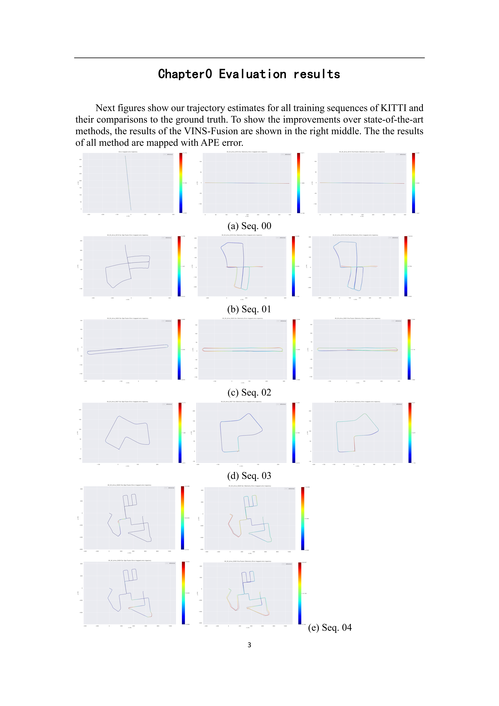
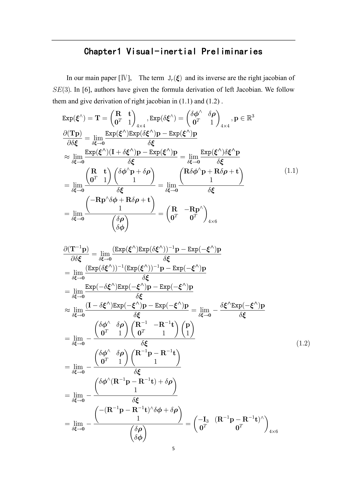
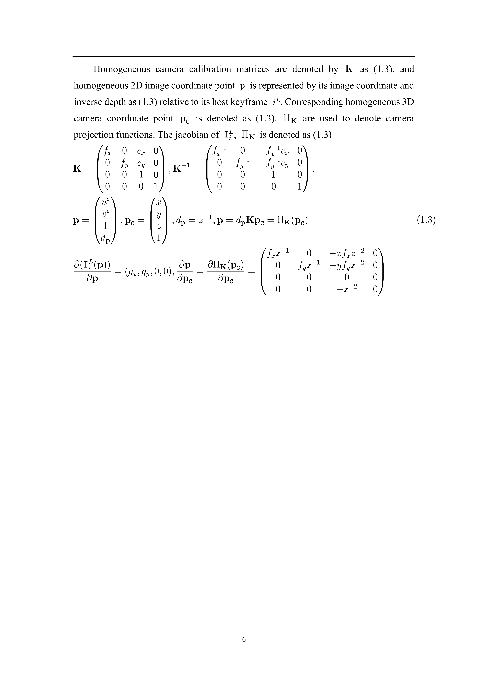
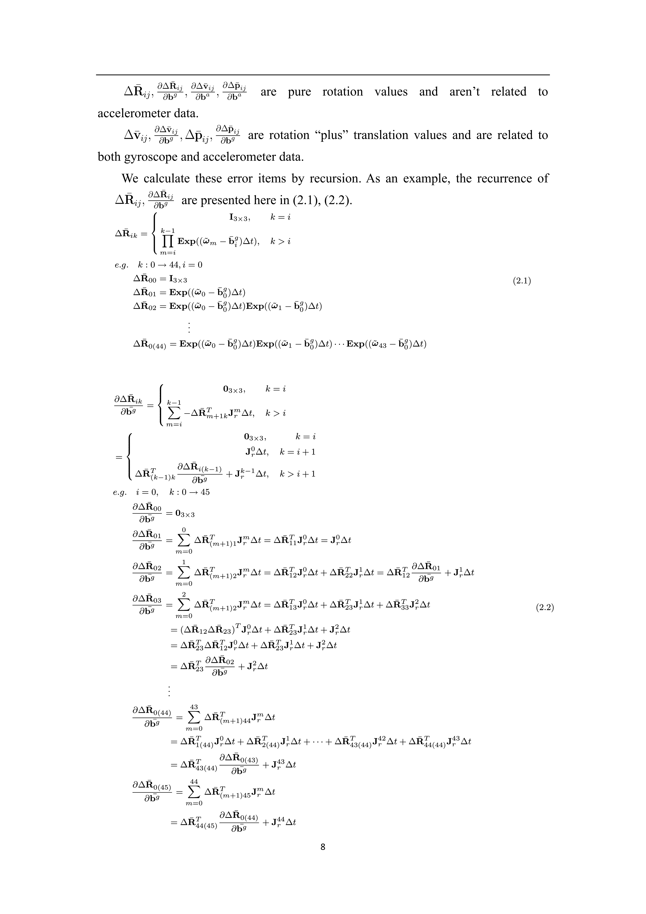
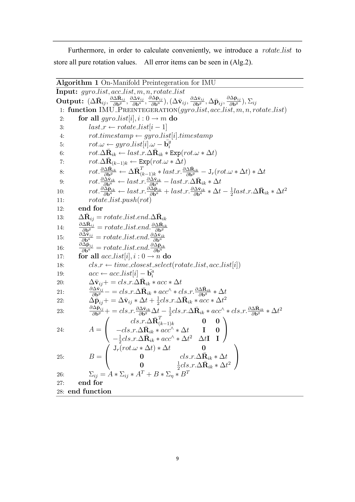
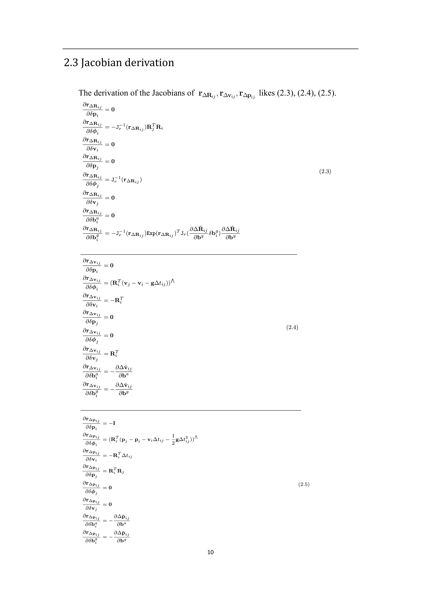
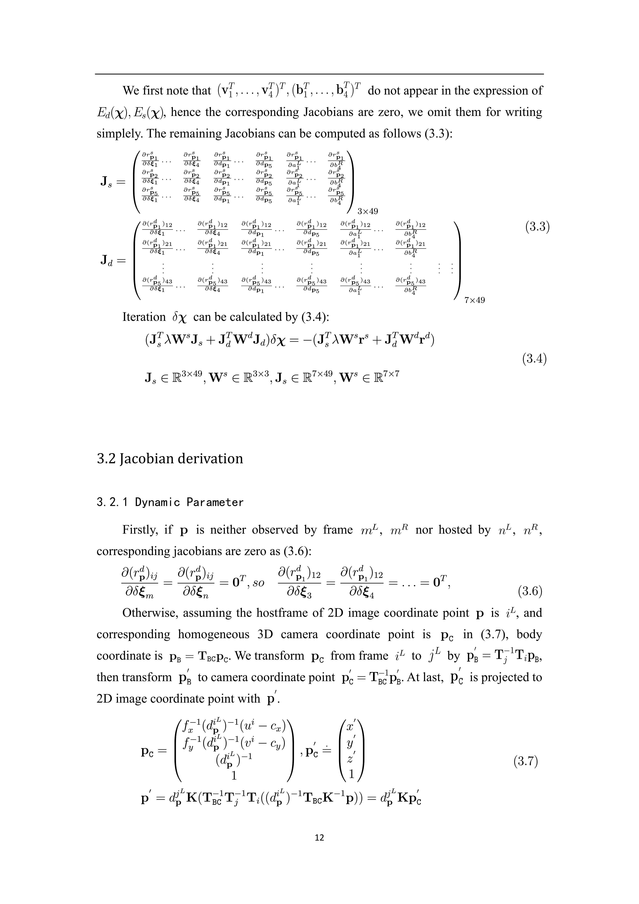
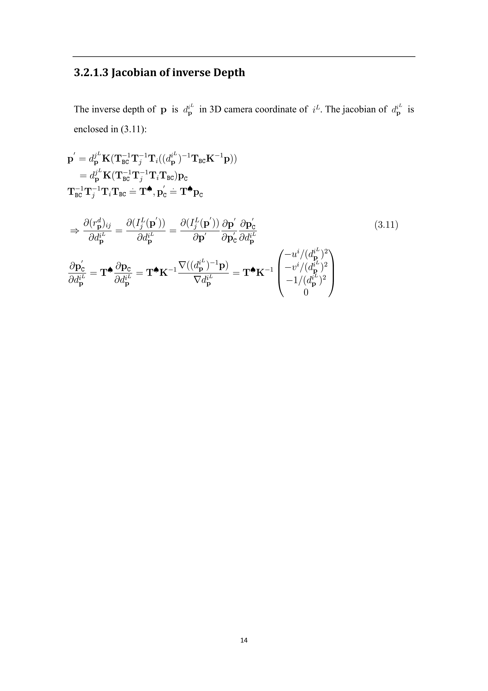

### This is supplementary material of DVIGO. If the page does not load images, you can also choose to download 
Sup_DVIGO.pdf 
 and read them

    

    

    

    

    

    

    

    

    

    

    

    

    

    

    

    

